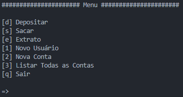
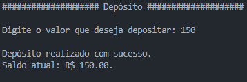
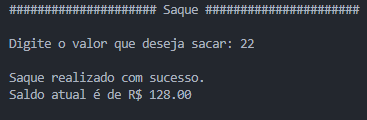
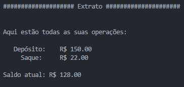
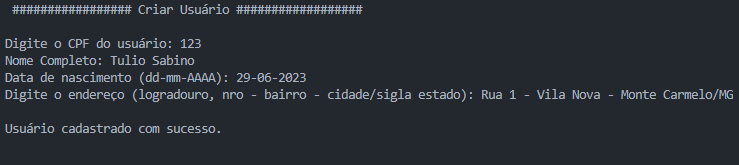
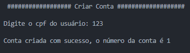
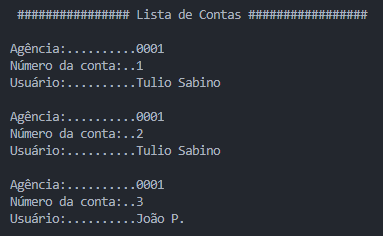

# Simulação de Sistema Bancário v2 💰
Este script implementa uma simulação básica de um sistema bancário, proposta em um desafio de código do bootcamp **_Potência Tech powered by iFood_**, permitindo que o usuário realize depósitos, saques, consulte o extrato, crie usuários, contas e liste todas as contas criadas.

Esta é a segunda versão do código que, além dos fundamentos, utiliza de funções para manter o código mais organizado e melhorar sua modularidade e adiciona as funções para criar usuários, contas e listagem das contas.

## Como Utilizar
Execute o script em um ambiente Python.
O menu será exibido, apresentando as opções disponíveis:

Escolha a opção desejada digitando a letra correspondente e pressionando Enter.

### Opção "Depositar" [d]
Ao selecionar a opção "Depositar", você poderá adicionar fundos à conta geral da aplicação. As operações de depósito não são vinculadas a cada conta criada.

Siga as instruções abaixo:
1. Digite o valor que deseja depositar quando solicitado.
1. Certifique-se de inserir um valor maior que zero e que contenha apenas números.
1. Após o depósito ser realizado, uma mensagem de sucesso e o saldo atual será exibido.

### Opção "Sacar" [s]
Ao selecionar a opção "Sacar", você poderá retirar dinheiro da conta geral da aplicação. As operações de depósito não são vinculadas a cada conta criada.

Siga as instruções abaixo:
1. Digite o valor que deseja sacar quando solicitado.
1. Certifique-se de inserir um valor válido, respeitando as seguintes condições:
    - O valor deve ser menor ou igual ao saldo disponível em sua conta.
    - O valor não pode ser superior a R$ 500 (limite de saque).
    - O valor deve ser maior que zero.
1. Após o saque ser realizado com sucesso, o saldo atual será exibido.

Observação: Existe um limite de 3 saques diários e um limite por saque de R$ 500.

### Opção "Extrato" [e]
Ao selecionar a opção "Extrato", você poderá visualizar o histórico de operações e o saldo atual da conta geral da aplicação. 

Siga as instruções abaixo:
1. O extrato será exibido, mostrando todas as operações realizadas.
1. Cada linha do extrato apresentará o tipo de operação (Depósito ou Saque) e o valor correspondente.
1. O saldo atual da conta será exibido no final.

### Opção "Novo Usuário" [1]
Ao selecionar a opção "Novo Usuário", será solicitado os dados do usuário a ser criado. Aqui os dados não são validados, aceitando qualquer valor que seja uma string, mas a alicação te informa os formatos padronizados para cada campo.

Siga as intruções abaixo:

1. Preencha o CPF.
1. Preencha o Nome Completo.
1. Preencha a data de Nascimento.
1. Preencha o endereço.

Após informar todos os dados, caso não haja outro usuário com o mesmo cpf, o programa informa que o usuário foi cadastrado com sucesso.

### Opção Nova Conta [2]
Ao selecionar a opção "Nova Conta", o programa solicitara o cpf do usuário a qual a nova conta ficará vinculada. Cada usuário pode ter quantas contas desejar e cada conta pertence a apenas um usuário.

Ao informar um cpf de usuário que já foi cadastrado previamente é informado que a conta foi criada com sucesso e também o número da conta.

### Opção Listar Todas as Contas [3]

Ao selecionar a opção "Listar todas as Contas", o programa vai retornar uma listagem com todas as contas inclusas no sistema.

### Opção "Sair" [q]
Ao selecionar a opção "Sair", o programa será encerrado.

## Váriaveis de configuração
- `usuarios` Inicialização da lista que contém os usuários durante a execução do programa.
- `contas` Inicialização da lista que contém as contas durante a execução do programa.
- `saldo` Saldo inicial da aplicação, que deve ser 0.
- `extrato` String que armazena as operações já feitas.
- `num_saques` Contador para limitar a quantidade de saques por execução do programa
- `limite_por_saque` Limite de valor para cada operação de saque.
- `limite_qtde_saques` Quantidade máxima de saques por execução do programa

🏦 Divirta-se utilizando o sistema! 🏦

